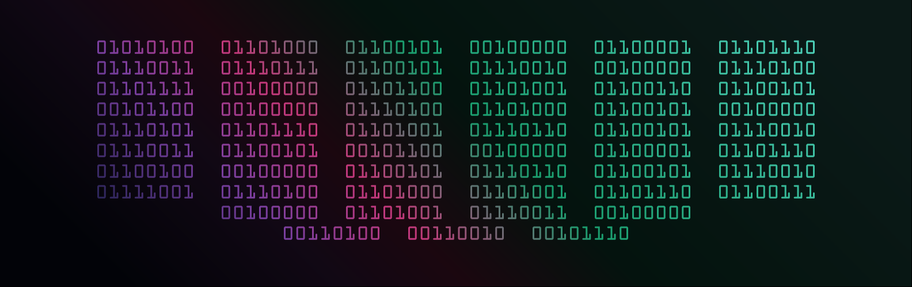

# Tabitha R Pennington

Building operational systems, immersive storefront interfaces, and workflow architecture.

## Current Focus
- Rails operational tooling
- Shopify/Liquid storefront systems
- Workflow automation interfaces
- Responsive UI architecture
- Compliance and intake systems

## Featured Projects

### Glass Header System
Responsive glass morphism navigation architecture extracted from a production Shopify storefront.

### Compliance Tracker Demo
Operational workflow architecture inspired by real-world fire compliance management systems.

### Workflow Intake Systems Demo
Structured intake and document pipeline interfaces for service operations.

## Background

Background in geology, GIS, technical systems, and earlier programming experience.

Returned to development work through The Odin Project in 2026, then rapidly expanded into production-oriented storefront systems, workflow architecture, and operational tooling projects.
